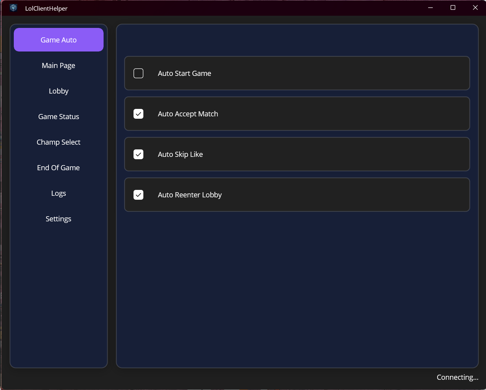
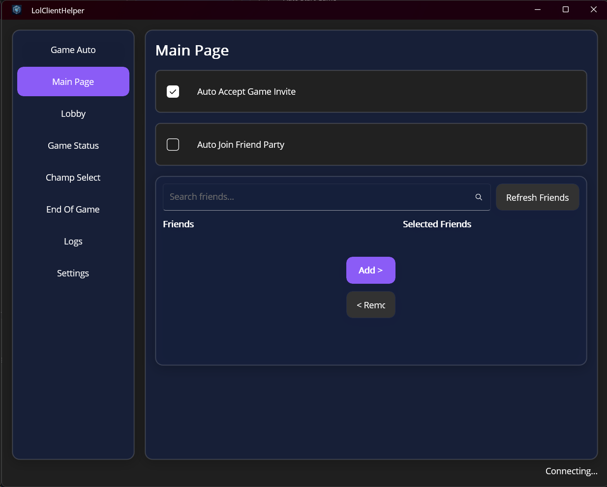
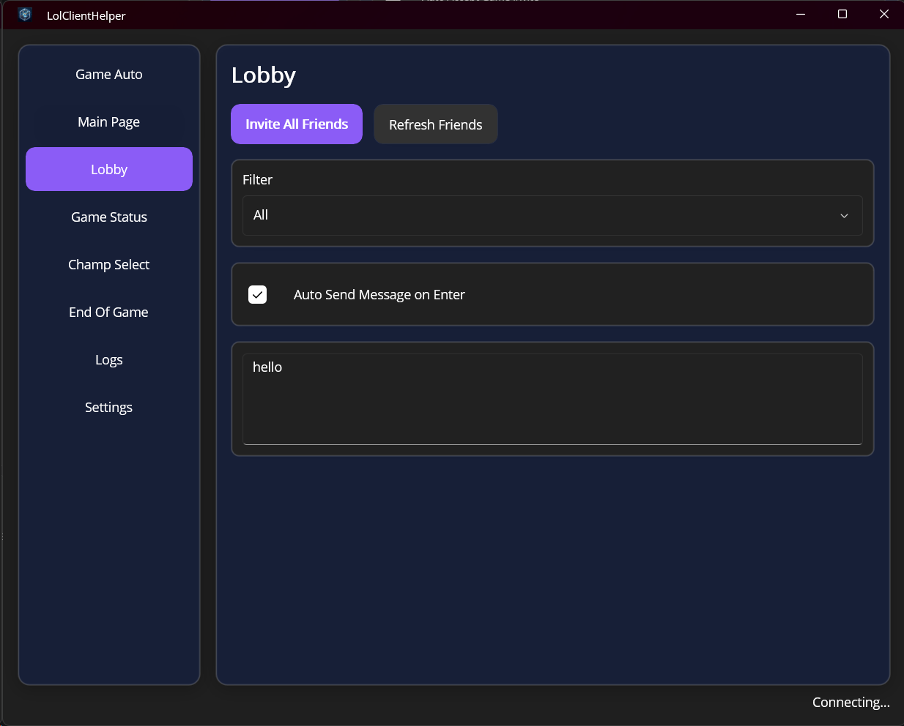
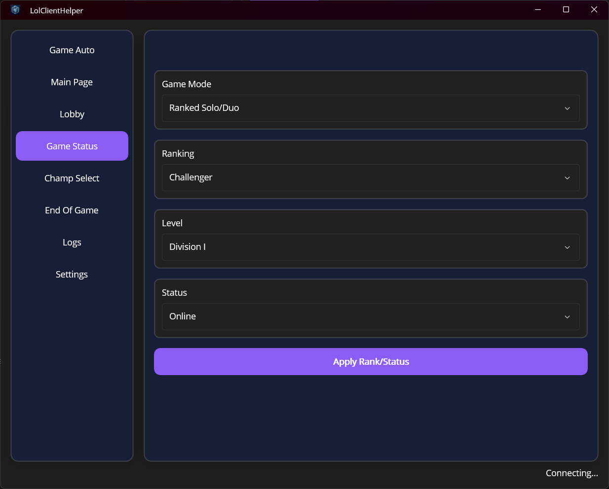
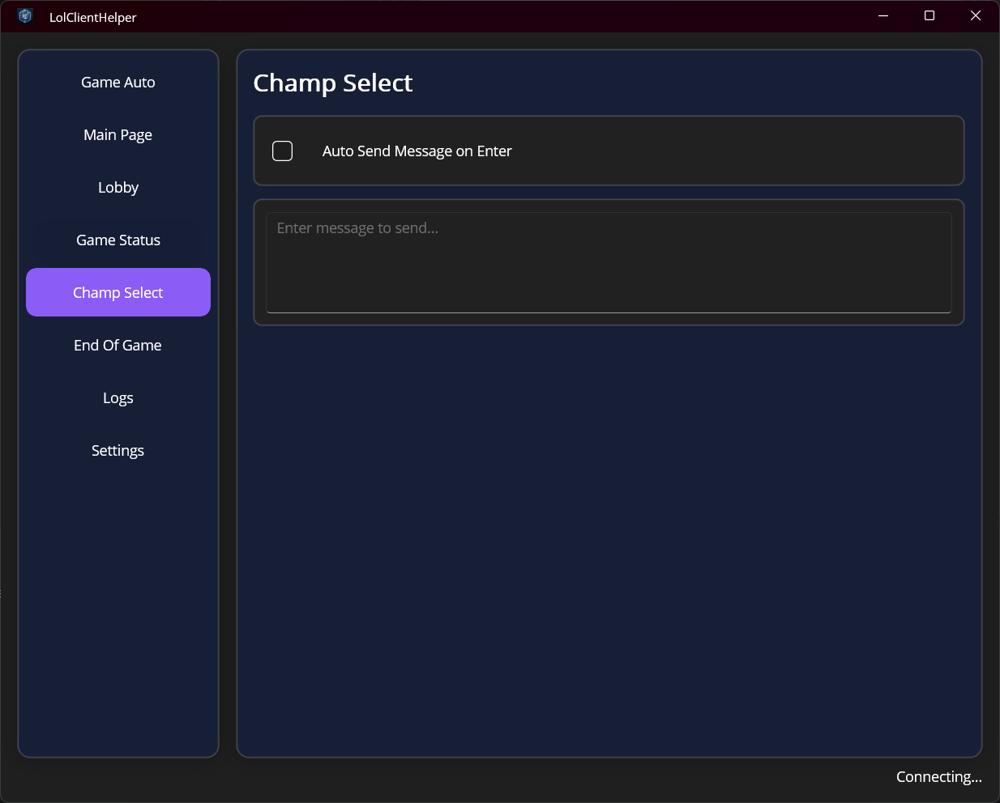
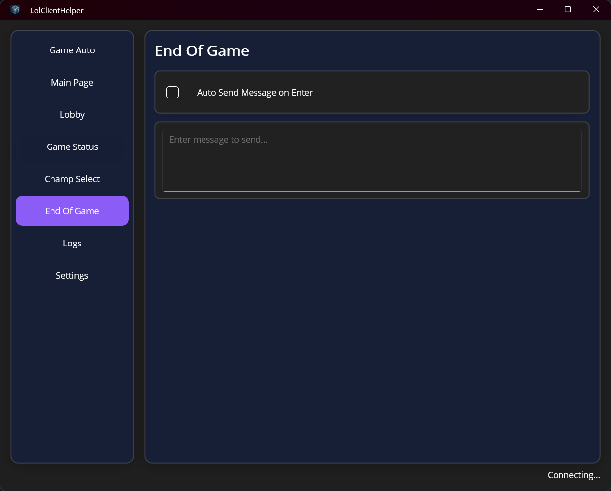
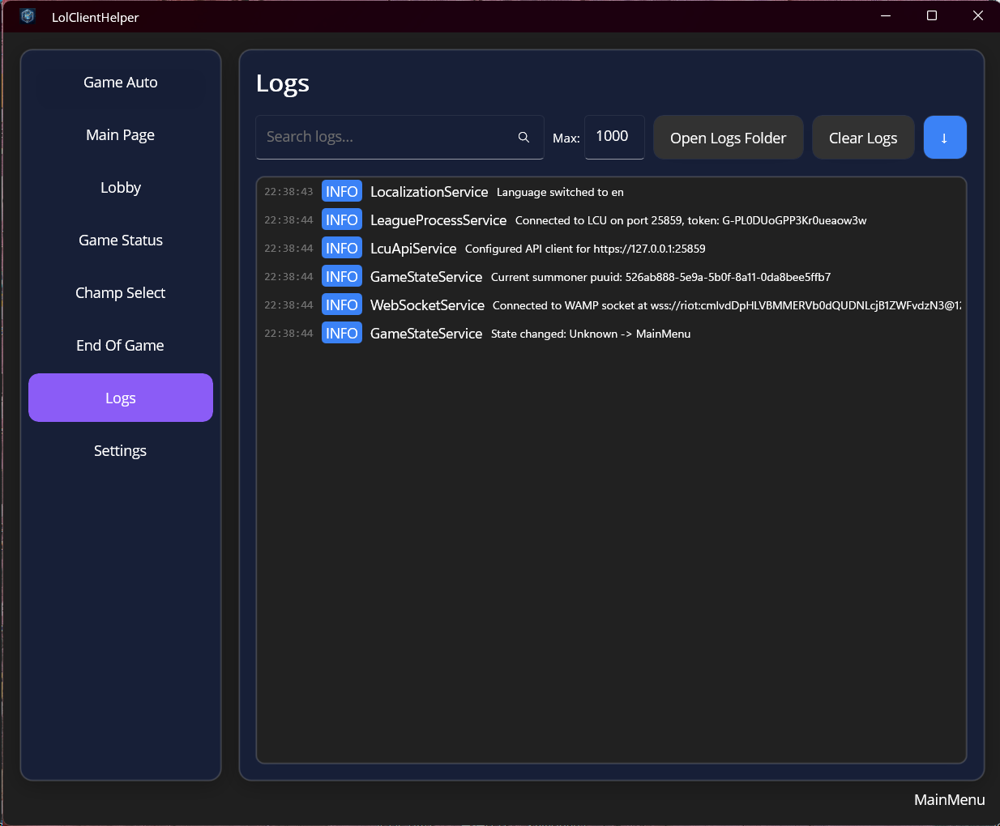
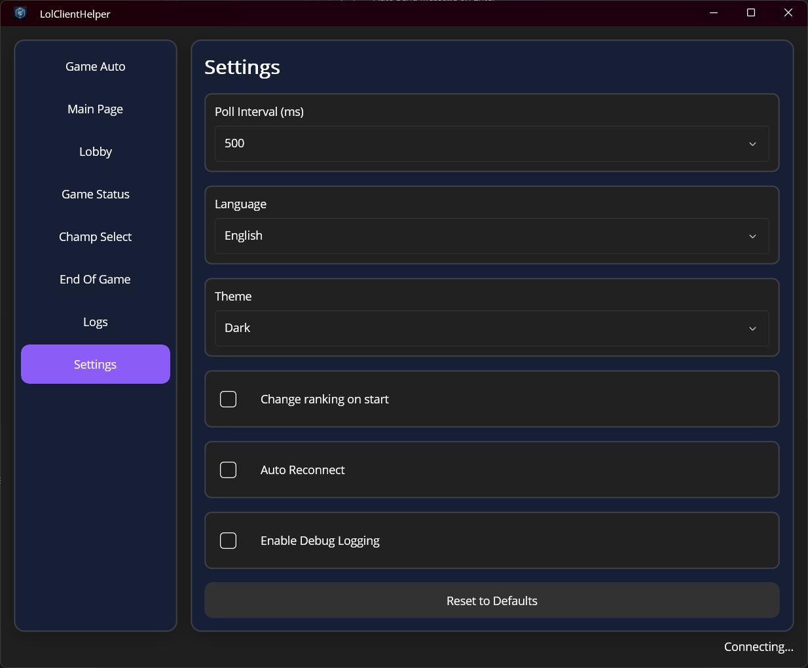

# LolClientHelper

A **.NET MAUI desktop application** for Windows that automates League of Legends client operations through the [LCU (League Client Update) API](https://developer.riotgames.com/docs/lol). Manage lobbies, accept games, send messages, spoof ranked status, and more — all from a sleek glass-themed UI.

---

## Features

### 🤖 Game Auto

| Feature | Description |
|---|---|
| **Auto Start Game** | Automatically searches for a match when in lobby. |
| **Auto Accept Match** | Automatically accepts the ready-check popup. |
| **Auto Skip Like** | Automatically skips the post-game honor screen. |
| **Auto Re-enter Lobby** | Automatically returns to lobby after a game ends. |



### 🏠 Main Page — Friends & Invites

| Feature | Description |
|---|---|
| **Auto Accept Invite** | Automatically accepts incoming party invitations. |
| **Auto Join Friend Party** | Monitors selected friends and auto-joins their open parties. |
| **Friend List** | Displays all friends with availability status (color-coded). |



### 🚪 Lobby

| Feature | Description |
|---|---|
| **Invite All Friends** | One-click invite of all online friends to your party. |
| **Refresh Friends** | Refresh the friend list to get current online status. |
| **Friend Group Filter** | Filter friends by custom friend groups. |
| **Auto Send Lobby Message** | Automatically sends a customizable message when joining a lobby. |



### 🏆 Game Status — Fake Rank

| Feature | Description |
|---|---|
| **Queue Type** | Set the displayed queue type (Solo/Duo, Flex, etc.). |
| **Rank Tier** | Set the displayed tier (Iron through Challenger). |
| **Division** | Set the displayed division (IV, III, II, I). |
| **Status** | Set the online status (chat, away, do not disturb, offline, mobile). |
| **Apply on Start** | Option to apply the fake rank automatically when the app starts. |



### ⚔️ Champ Select

| Feature | Description |
|---|---|
| **Auto Send Message** | Automatically sends a customizable message when entering champion selection. |



### 📊 End of Game

| Feature | Description |
|---|---|
| **Auto Send Message** | Automatically sends a customizable message when the game ends. |



### 📋 Logs

| Feature | Description |
|---|---|
| **Search** | Full-text search through log entries with keyword highlighting. |
| **Max Lines** | Configurable limit on displayed log entries. |
| **Auto-scroll** | Toggle auto-scroll to follow new log entries. |
| **Open Logs Folder** | Opens the log file directory in File Explorer. |
| **Clear Logs** | Clears the current in-memory log display. |



### ⚙️ Settings

| Feature | Description |
|---|---|
| **Poll Interval** | HTTP polling interval (250–5000 ms) when WebSocket is unavailable. |
| **Language** | UI language — English, 简体中文, 繁體中文. |
| **Theme** | Auto, Light, or Dark mode. |
| **Change Ranking on Start** | Apply fake rank settings on app launch. |
| **Start Minimized** | Launch the app minimized to the taskbar. |
| **Debug Mode** | Enable verbose debug logging. |


---

## Architecture

```
┌─────────────────────────────────────────────────────────┐
│                    MainPage (TabContainer)               │
│  ┌──────┐ ┌────────┐ ┌──────┐ ┌──────────┐ ┌────┐ ─ ─  │
│  │Game  │ │Main    │ │Lobby │ │GameStatus│ │CS  │ ...   │
│  │Auto  │ │PageTab │ │      │ │          │ │    │       │
│  └──────┘ └────────┘ └──────┘ └──────────┘ └────┘       │
└───────────────────────┬─────────────────────────────────┘
                        │
┌───────────────────────▼─────────────────────────────────┐
│                    ViewModels (MVVM)                     │
│  GameAutoVM  MainPageVM  LobbyVM  GameStatusVM  ...      │
│            ChampSelectVM  EndOfGameVM  LogsVM            │
│                   SettingsVM  MainVM                     │
└───────────────────────┬─────────────────────────────────┘
                        │
┌───────────────────────▼─────────────────────────────────┐
│                   Services Layer                         │
│  ┌──────────────┐  ┌──────────────┐                     │
│  │LCU API       │  │WebSocket     │                     │
│  │(HTTP Client) │  │(WAMP/JSON)   │                     │
│  └──────┬───────┘  └──────┬───────┘                     │
│         │                 │                              │
│  ┌──────▼─────────────────▼───────┐                     │
│  │     GameStateService            │                     │
│  │  (polling + WS event bridge)    │                     │
│  └─────────────────────────────────┘                     │
│  ┌────────────┐ ┌──────────────┐ ┌──────────────────┐   │
│  │Process     │ │Settings      │ │LoggingService    │   │
│  │Service     │ │Service       │ │(rolling files)   │   │
│  └────────────┘ └──────────────┘ └──────────────────┘   │
│  ┌────────────┐ ┌──────────────┐                        │
│  │Localization│ │WindowService │                        │
│  └────────────┘ └──────────────┘                        │
└─────────────────────────────────────────────────────────┘
                        │
            ┌───────────▼───────────┐
            │   League Client UX    │
            │  (LCU API - HTTPS)    │
            │ 127.0.0.1:{PORT}      │
            └───────────────────────┘
```

### Technology Stack

| Component | Technology |
|---|---|
| **Framework** | .NET MAUI 9 (Windows-only) |
| **Language** | C# 12 |
| **Target** | `net9.0-windows10.0.19041.0` |
| **Architecture** | MVVM |
| **HTTP Client** | `HttpClient` with self-signed cert bypass |
| **WebSocket** | Raw WAMP protocol over `System.Net.WebSockets` |
| **JSON** | `System.Text.Json` |
| **DI** | `Microsoft.Extensions.DependencyInjection` |
| **Settings** | JSON file in `%APPDATA%\LolClientHelper\` |
| **Logging** | Rolling file logs in `%APPDATA%\LolClientHelper\logs\` |
| **Process Query** | WMI (`Get-CimInstance Win32_Process`) |

### Services

| Service | Responsibility |
|---|---|
| **LeagueProcessService** | Finds `LeagueClientUx.exe`, parses port & auth token from its command line. |
| **LcuApiService** | HTTP client to the LCU REST API with Basic auth and SSL bypass. |
| **WebSocketService** | WAMP protocol over WebSocket — subscribes to LCU events. |
| **GameStateService** | Polls game flow state + bridges WebSocket events to ViewModels. |
| **LoggingService** | Rolling file logger with configurable max size/count. |
| **SettingsService** | Loads/saves `settings.json` in `%APPDATA%\LolClientHelper\`. |
| **LocalizationService** | Multi-language support (en, zh-CN, zh-TW) via `.resx` files. |
| **WindowService** | Opens the standalone Settings window. |

---

## How It Works

### LCU API Communication

1. **Process Discovery**: The app queries WMI for `LeagueClientUx.exe` and parses `--app-port` and `--remoting-auth-token` from its command line (requires admin privileges).
2. **Authentication**: All API calls use Basic Auth with `riot:{TOKEN}` over HTTPS to `127.0.0.1:{PORT}`.
3. **SSL Bypass**: The self-signed localhost certificate is accepted via a custom `ServerCertificateCustomValidationCallback`.
4. **Event Subscription**: A WebSocket connection (WAMP protocol) listens for real-time events from the LCU — lobby changes, game flow transitions, friend availability, etc.
5. **Fallback Polling**: If WebSocket disconnects, `GameStateService` falls back to HTTP polling at a configurable interval (default: 500ms).

### Connection Retry

If the League client is not running, the app retries process discovery every 10 seconds indefinitely. Once connected, it monitors the connection and automatically reconnects on disconnect.

---

## Requirements

- **OS**: Windows 10 (build 17763+) or Windows 11
- **Runtime**: [.NET 9 SDK](https://dotnet.microsoft.com/download/dotnet/9.0)
- **Game**: League of Legends (must be running for the app to function)
- **Permissions**: **Administrator privileges** (required to read `LeagueClientUx.exe` command-line arguments). The app manifest includes `requireAdministrator`.

---

## Build & Run

### Build

```bash
dotnet publish -f net9.0-windows10.0.19041.0 -c Release -p:WindowsPackageType=None -p:WindowsAppSDKSelfContained=true
```

The output will be in `bin/dev1/{configuration}/net9.0-windows10.0.19041.0/`. Run `LolClientHelper.exe` as Administrator.

### Build (Debug)

```bash
dotnet build -f net9.0-windows10.0.19041.0
```

### Run Directly

```bash
dotnet run -f net9.0-windows10.0.19041.0
```

## Configuration

Settings are persisted to `%APPDATA%\LolClientHelper\settings.json` as plain JSON. You can also configure everything from the Settings tab inside the app.

### Key Settings

| Key | Type | Default | Description |
|---|---|---|---|
| `AutoAcceptMatch` | bool | `true` | Auto-accept ready checks |
| `AutoSkipLike` | bool | `true` | Auto-skip honor screen |
| `AutoReenterLobby` | bool | `true` | Auto-return to lobby post-game |
| `AutoAcceptInvite` | bool | `true` | Auto-accept party invites |
| `Tier` | string | `"CHALLENGER"` | Fake rank tier |
| `Division` | string | `"I"` | Fake rank division |
| `Theme` | string | `"Dark"` | UI theme (Auto/Light/Dark) |
| `Language` | string | `"en"` | UI language (en/zh-CN/zh-TW) |
| `PollIntervalMs` | int | `500` | Polling interval (250-5000) |
| `AutoSendChampSelectMessage` | bool | `false` | Auto-message in champ select |
| `AutoSendEndOfGameMessage` | bool | `false` | Auto-message at game end |

---

## Logging

Logs are written to rolling files in `%APPDATA%\LolClientHelper\logs\`:

```
logs/
├── log-2025-05-25.txt
├── log-2025-05-24.txt
└── ...
```

Each log entry includes a timestamp, log level, and message. The Logs tab in the app provides a searchable, real-time view of the current session logs.

---

## Localization

The app supports three languages:

| Code | Language | File |
|---|---|---|
| `en` | English | `Resources/Strings/Strings.resx` |
| `zh-CN` | 简体中文 | `Resources/Strings/Strings.zh-CN.resx` |
| `zh-TW` | 繁體中文 | `Resources/Strings/Strings.zh-TW.resx` |

The language can be changed at runtime from the Settings tab.

---

## Project Structure

```
LolClientHelper/
├── Models/              # Data models (AppSettings, Friend, GameFlowSession, etc.)
├── ViewModels/          # MVVM ViewModels (one per tab + MainViewModel)
├── Views/               # XAML views (one per tab + SettingsWindow)
├── Services/            # Business logic (LCU API, WebSocket, logging, etc.)
├── Converters/          # XAML value converters
├── Resources/
│   ├── AppIcon/         # Application icons
│   ├── Fonts/           # Custom fonts
│   ├── Images/          # Image assets
│   ├── Raw/             # Raw assets
│   ├── Splash/          # Splash screen
│   ├── Strings/         # .resx localization files
│   └── Styles/          # Colors.xaml, Styles.xaml (glass theme)
├── Platforms/Windows/   # Windows-specific code & app.manifest
├── Properties/          # Build properties
├── Converters/          # IValueConverter implementations
├── MauiProgram.cs       # DI container setup
├── App.xaml / App.xaml.cs    # Application entry point
├── MainPage.xaml / .cs      # Tab container
└── SPEC.md              # Detailed feature specification
```

---

## Development

### Prerequisites

- [Visual Studio 2022](https://visualstudio.microsoft.com/) with the **.NET MAUI** workload
- or [.NET 9 SDK](https://dotnet.microsoft.com/download/dotnet/9.0) with MAUI workload:
  ```bash
  dotnet workload install maui
  ```

### Build Notes

- **Windows-only**: The project targets `net9.0-windows10.0.19041.0` only.
- **No MSIX packaging**: `WindowsPackageType=None` produces a plain `.exe`.
- **Self-contained**: `WindowsAppSDKSelfContained=true` bundles the Windows App SDK runtime.
- **Admin manifest**: The app requests administrator privileges via `app.manifest`.

---

## Disclaimer

LolClientHelper is **not** endorsed by Riot Games and does **not** reflect the views or opinions of Riot Games or anyone officially involved in producing or managing League of Legends. League of Legends and Riot Games are trademarks or registered trademarks of Riot Games, Inc.
